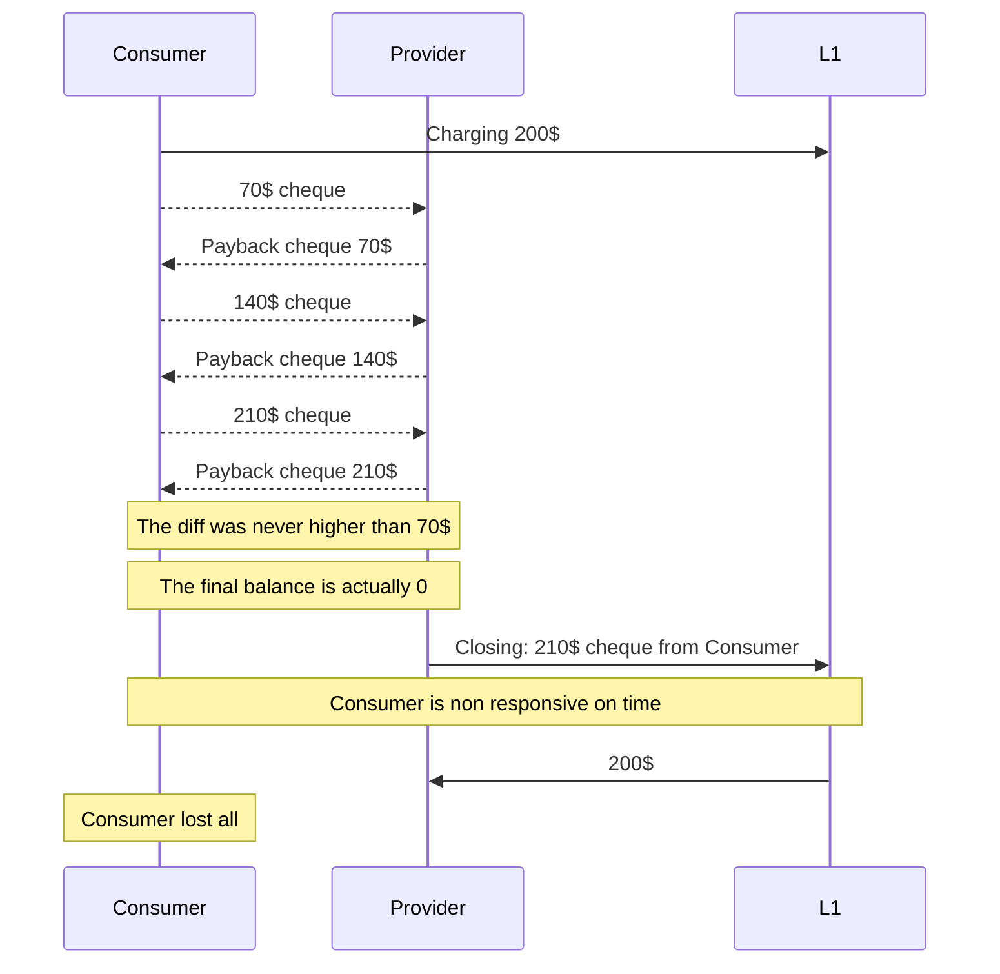
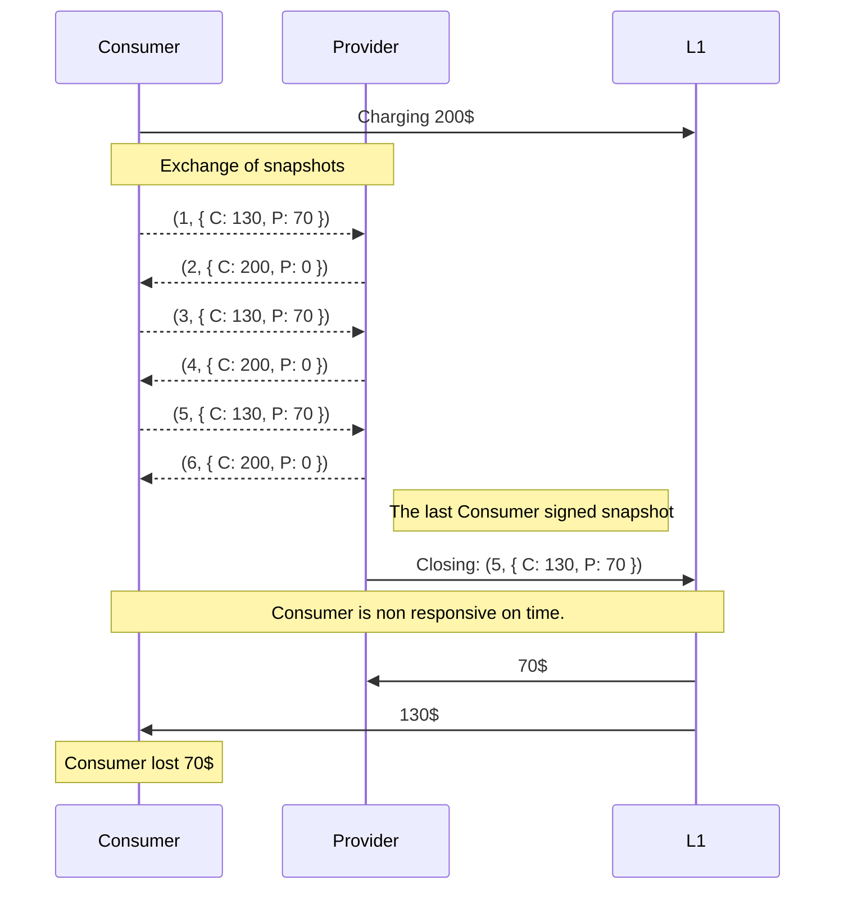

Status: Draft

# Channel state representation

## Cheque formats

There are multiple approaches which we can accomodate in order to exchange commitments and track the channel state:

- `SimpleCheque` - plain and cummulative single direction payments:

  ```typescript
  type SimpleCheque = {
    // ever increasing payment
    payment: bigint;
  };
  ```

- `LossPreventingCheque` - cheques with loss prevention mechanism:

  ```typescript
  type LossPreventingCheque = {
    // ever increasing payment
    payment: bigint;
    // the highest last cheque from the counterparty
    payback: bigint;
  };
  ```

- `Snapshot` - snapshot of the state which is indexed:

  ```typescript
  type Snapshot = {
    // ever increasing id
    id: bigint;
    // a transfer vector between the two accounts
    transfer: bigint;
  };
  ```

## Cashouts

Because consensus will loook in every case the same - just a final balance signed by both parties the only worth consideration flow which we should analyze is non consensus closure.

### `SimpleCheque`

There are few interesting properties of this scheme:

- Unbounded loss - an inactive party can be serverily penalized if it does not respond during closure.
- Unidirectionality - only a single party has to sign the intention.
- Possibly huge integer values - this can have slight impact on the ledger costs.

Conrecte unbounded loss example:



### `LossPreventingCheque` and `Snapshot`

Beside the difference in size (`Snapshot` can be smaller in size than `LossPreventingCheque`) we can consider them both to be "isomorphic" from operational perspective: both provide information about total balance and about ordering. Let's use `Snapshot` from now on for the sake of simplicity.

#### Single Signed Snapshots



Few observations:

- In the case of single signed snapshots party `A` should only provide snapshots signed by `B` because `A` can submit arbitrary snapshot signed by `A` which is impossible to contest (?) by `B` (everyone can sign their own arbitrary snapshots).

- Because of the above `Provider` is not able to submit the last snapshot signed by himself.

- This submission should not be penalized if `Consumer` actually had provided the last snapshot signed by the `Provider`.

### Full Consensus Signing

## Pending payments

In the context of composition of channels and pending payments it seems really beneficial to use
