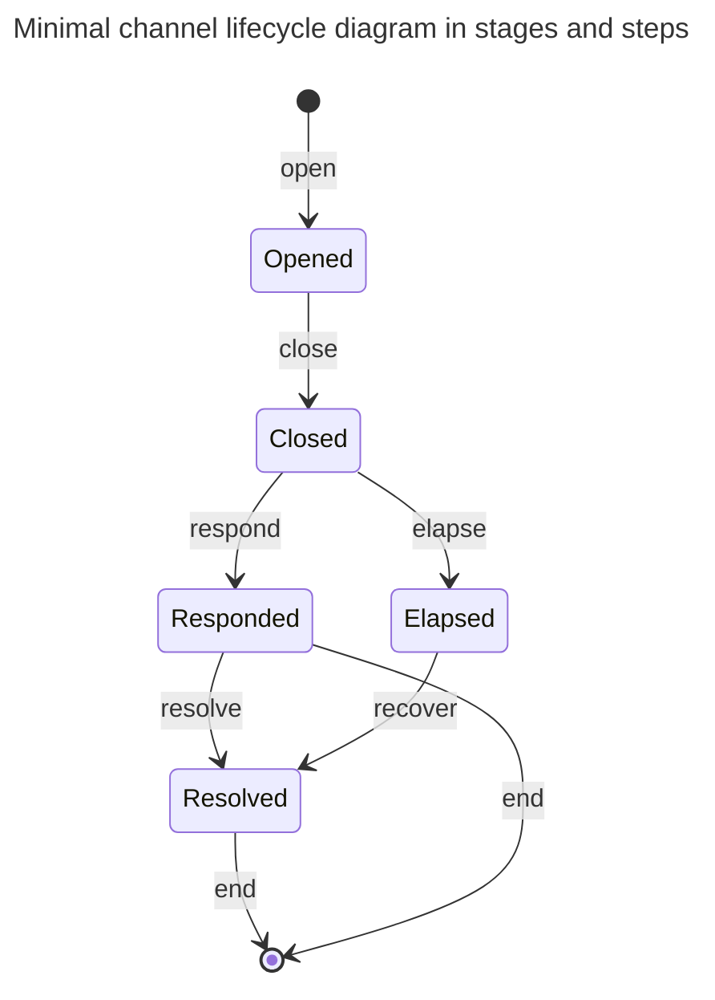

## Context

CL needs a starting point. We propose the minimal lifecycle.

This ADR introduces fundamental components and vocab. It is focussed only on
what is essential to the L1 component so that a channel is safe functional and
safe. It is not concerned with any nice-to-haves, or efficiency.

## Decision

### Preamble

CL is a network.

Users of the network are **participants** and form the nodes of the graph of the
network.

A **channel** is an edge to the network connecting two participants. A channel
compromises of state and actions that happen both on-chain and off-chain. The
two nodes connected by a channel are **partners**.

On-chain, a channel is represented by utxos, at most one at tip at any one time.
While such a utxo exists at tip, the channel is **staged** (see 'stages' below).
After the utxo is spent and not replaced, the channel is **unstaged**. A channel
that is unstaged will never again be staged. Unless otherwise specified,
"channel" generally means "channel that is staged".

A channel has state on the L1. Note that we avoid using the term "state" to have
a specified meaning. This is so it can be employed and specified in a given
context, without being confusing. The relevant state may be the datum, or the
datum and value, or the whole utxo, or a set of utxos, or include additional
off-chain data _etc_.

The Cardano unit of change is the transaction. A transaction involving a channel
is said to **step** the channel. A single transaction may involve many channels.
From the perspective of a single channel, we can abstract transactions and talk
in terms of steps.

The term step is used both to refer to a specific event, or a general family of
events. For example: "this transaction steps that channel", and "an 'open' is
the initial step of a channel".

A staged channel will be at a **stage** in its lifecycle. A step may:

- stage or unstage a channel,
- take a channel from a stage to the same stage, or
- take a channel from one stage to the next stage

### Channel lifecycle

Nodes are stages; arrows are steps.

One participant initiates an **open** step. This stages a channel into its
**opened** stage. This is the main stage of the channel. In the open step the
participant locks funds at the utxo as guarantee of their off-chain transacting.
During this stage participants are actively transacting with each other
off-chain.

While the channel is opened, either participant may perform an **add** step.
This does not change the stage of the channel. There is no limit to how many add
steps can be performed. The participant locks more funds in the channel as
further guarantee of their off-chain transacting.

Once a participant no longer wishes to continue the arrangement they perform a
**close** step. The channel is now **closed**. In the close the participant
includes a summary of their off-chain transacting. They should no longer be
transacting off-chain beyond this point. The time window for the other
participant to provide their summary begins. There are two possible next steps.

The other participant is able to perform a **resolve** step. They provide their
summary to the L1, and can then unlock the funds they are due. The channel is
now in the **resolved** stage.

Both a close and a resolve step are **settle** steps, so called because it is
when the partner "settles" their L2 state on the L1.

From the resolved stage, the participant that performed the close can finally
**end** the channel. In doing, the channel is unstaged and all remaining funds
are unlocked.

Alternatively, the participant who performed the close step may perform an
**elapse** step. This is valid only after the aforementioned time window has
elapsed without the other participant performing a resolve. The step allows the
participant to unlock the funds they demonstrated they were due. The channel is
now in the **elapsed** stage.

From the elapsed stage, the other participant can perform a **recover** step.
This unstages the channel and unlocks the remaining funds.

### Freeing locked cheques

There is a important aspect overlooked in the above that must now be considered.

The off-chain transacting can involve 'locked cheques'. Theses are cheques that
are valid only if some conditions are satisfied. It will not necessarily be
known at a close or a resolve step which partner should ultimately own the
associated funds.

If the partner performing a settle includes locked cheques as part of their L2
state. Theses are recorded on the L1 until one partner can claim the associated
value. These is done via a **free** step. It is possible to perform a **free**
step on any stage passed a close.

### Rationale

\-

## Discussion, Counter and Comments

### Comments

#### Less than a spec

This document does not aspire to be detailed enough to be considered a spec. It
is two establish the key terms and entities so that future discussions start
with a shared vocabulary.

#### Motivating terms

Bitcoin Lightning inspires the use of the term 'close'. Beyond this, the framing
is in terms of partially built transactions, rather the channel lifecycle.

Other vocab was discussed. Choosing terms is a game of compromise that hopefully
ends in between good enough and not bad. No terms borrowed from English will
perfectly fit the precise shape of their employment in technical contexts like
here.

Some considered alternatives

- live/dead for opened/closed. Sounded to zombie-esque.
- phases for stages: the latter has stronger connotations of direction.

#### Minimality

A mutual close is not essential for a complete lifecycle. This will be left for
a future ADR. The add step will also be left for a future ADR.

It's been mooted that close includes the approved output address.

#### Unilateral-ness

The steps chosen are unilateral actions - they do not require any cooperation
between the participants. Moreover the steps chosen expect a participant to look
after only their own funds. The script is present to keep both participants
safe.

For example, we could have chosen that the resolve step unstages the channel,
and that the script ensures that both participants receive the funds they are
due. This is feasible and in some sense simpler, with respect to fewer steps.
However, it introduces additional complexities into the script. Naively
implemented, it would introduce the potential of double satisfaction attacks.

We may revisit this in future.

### Considered Alternatives

\-

## Consequences

\-
