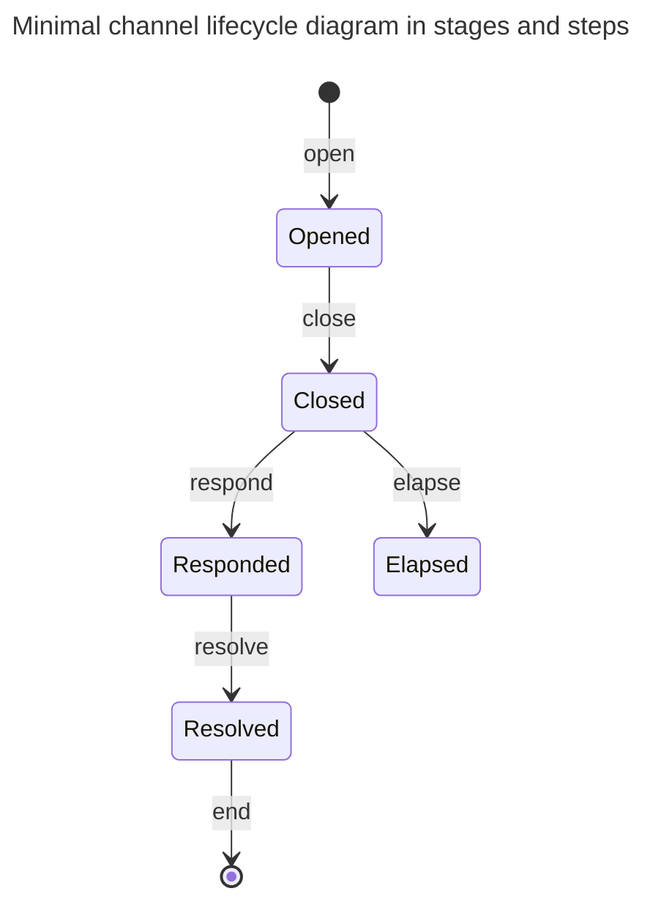

## Context

CL needs a starting point. We propose the minimal lifecycle.

This ADR introduces fundamental components and vocab. It is focussed only on
what is essential to the L1 component so that a channel is safe functional and
safe. It is not concerned with any nice-to-haves, or efficiency.

## Decision

### Preamble

CL is a network.

Users of the network are **participants** and form the nodes of the graph of the
network.

A **channel** is an edge to the network connecting two participants. A channel
compromises of state and actions that happen both on-chain and off-chain. The
two nodes connected by a channel are **partners**.

On-chain, a channel is represented by utxos, at most one at tip at any one time.
While such a utxo exists at tip, the channel is **staged** (see 'stages' below).
After the utxo is spent and not replaced, the channel is **unstaged**. A channel
that is unstaged will never again be staged. Unless otherwise specified,
"channel" generally means "channel that is staged".

A channel has state on the L1. Note that we avoid using the term "state" to have
a specified meaning. This is so it can be employed and specified in a given
context, without being confusing. The relevant state may be the datum, or the
datum and value, or the whole utxo, or a set of utxos, or include additional
off-chain data _etc_.

The Cardano unit of change is the transaction. A transaction involving a channel
is said to **step** the channel. A single transaction may involve many channels.
From the perspective of a single channel, we can abstract transactions and talk
in terms of steps.

The term step is used both to refer to a specific event, or a general family of
events. For example: "this transaction steps that channel", and "an 'open' is
the initial step of a channel".

A staged channel will be at a **stage** in its lifecycle. A step may:

- stage or unstage a channel,
- take a channel from a stage to the same stage, or
- take a channel from one stage to the next stage

### Channel lifecycle

Nodes are stages; arrows are steps.

One partner initiates an **open** step. This stages a channel into its
**opened** stage. This is the main stage of the channel. In the open step the
partner locks funds at the utxo as guarantee of their off-chain transacting.
During this stage partners are actively transacting with each other off-chain.

While the channel is opened, either partner may perform an **add** step. This
does not change the stage of the channel. There is no limit to how many add
steps can be performed. The partner locks more funds in the channel as further
guarantee of their off-chain transacting.

Once a partner no longer wishes to continue the arrangement they perform a
**close** step. The channel is now **closed**. In the close the partner, called
the **closer**, includes a summary of their off-chain transacting. They should
no longer be transacting off-chain beyond this point.

On a close of a channel, the respond period begins. The length of this period is
a property of the script, and known by partners on an open.

The other partner is able to perform a **respond** step. They provide their
summary to the L1, and can then remove the funds they are due. The channel is
now in the **responded** stage.

Both a close and a respond step are **settle** steps, so called because it is
when the partner "settles" their L2 state on the L1.

From the responded stage, the closer can **resolve** the channel. In doing, they
are able to remove the funds they are owed. This action may result in one of two
outcomes. If there are no outstanding locked cheques, then the channel is
unstaged. However, if there are outstanding locked cheques, then the channel is
now in a resolved stage.

Alternatively, if no respond has occurred by the end of the respond period, then
the closer can perform an **elapse** step. The partner is able to remove the
funds they demonstrated they are owed. If this is essentially the entire channel
funds, then this step is terminal. Otherwise the channel is now in an
**elapsed** stage.

After an elapse, the partner that failed to provide a respond step, can now
perform a **recover** step. If there are no pending locked cheques, then the
channel is unstaged. If there are pending locked cheques, then the channel
remains in an elapsed stage.

### Freeing locked cheques

There is a important aspect hinted in the above that must now be considered.

The off-chain transacting can involve 'locked cheques'. Theses are cheques that
are valid only if some conditions are satisfied. It will not necessarily be
known at a settle step which partner should ultimately own the associated funds.

The partner performing a settle includes the locked cheques as part of their L2
state. Theses are recorded on the L1 until one partner can claim the associated
funds. If a partner is able to demonstrate they are owed the associated funds,
they can perform a **free** step. It is possible to perform a free step on any
stage passed a close.

From a closed stage, only the closer has settled, so only they can perform a
free. The funds associated to a freed cheque are not released, but added to
their balance.

From a responded stage, the closer should resolve the channel to a resolved
stage. Regardless, either partner can perform a free step. The associated funds
are released immediately.

From a resolved stage either partner may perform a free step. The funds are
released.

From an elapsed stage, again only the closer has settled, so only they can
perform a free. Since the non-closer failed to provide their receipt in a timely
fashion, any funds associated to pending locked cheques they have received will
not have been considered when releasing the opener their funds. For the closer,
the funds associated to a freed cheque are immediately released.

### Rationale

\-

## Discussion, Counter and Comments

### Comments

#### Less than a spec

This document does not aspire to be detailed enough to be considered a spec. It
is two establish the key terms and entities so that future discussions start
with a shared vocabulary.

#### Motivating terms

Bitcoin Lightning inspires the use of the term 'close'. Beyond this, the framing
is in terms of partially built transactions, rather the channel lifecycle.

Other vocab was discussed. Choosing terms is a game of compromise that hopefully
ends in between good enough and not bad. No terms borrowed from English will
perfectly fit the precise shape of their employment in technical contexts like
here.

Some considered alternatives

- live/dead for opened/closed. Sounded to zombie-esque.
- phases for stages: the latter has stronger connotations of direction.

#### Minimality

A mutual close is not essential for a complete lifecycle. This will be left for
a future ADR. The add step will also be left for a future ADR.

It's been mooted that close includes the approved output address.

#### Unilateral-ness

The steps chosen are unilateral actions - they do not require any cooperation
between the partners. Moreover the steps chosen expect a partner to look after
only their own funds. The script is present to keep both partners safe.

For example, we could have chosen that the respond step unstages the channel,
and that the script ensures that both partners receive the funds they are due.
This is feasible and in some sense simpler, with respect to fewer steps.
However, it introduces additional complexities into the script. Naively
implemented, it would introduce the potential of double satisfaction attacks.

We may revisit this in future.

### Considered Alternatives

#### De-threading pending cheques

We contemplated splitting the pending cheques into a separate thread. There are
some advantages to this.

It compounds the problem of min ada - which exists for single thread, but
becomes 40 times worse if, say, locked cheques must be split off into their own
inputs on a settle, and support 40 outputs.

A single separate thread for each partners pending cheques is another option.
Ultimately, it was judged to just move the complexity, while introducing new
questions (eg will we need additional thread tokens if we choose to use thread
tokens).

## Consequences

\-
