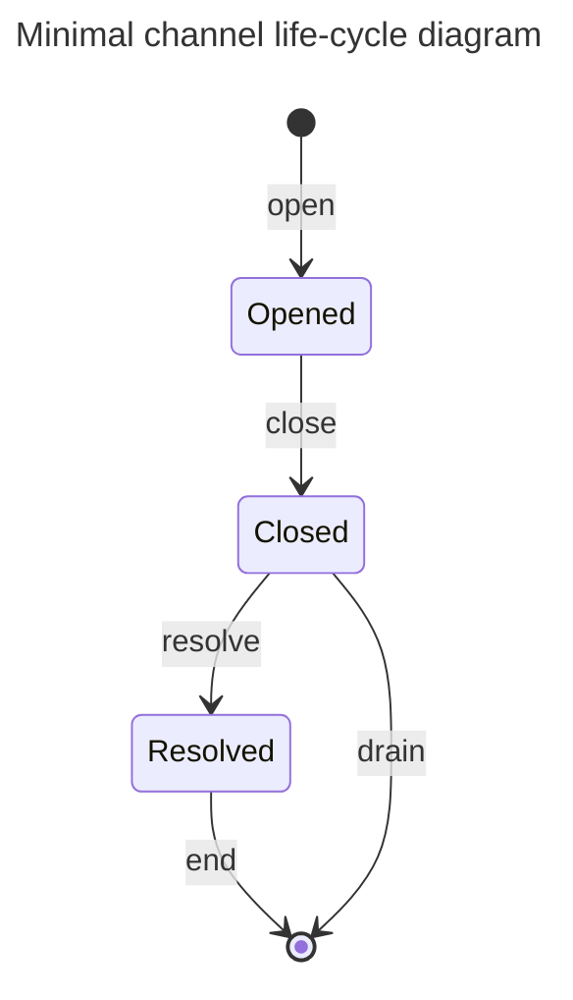

## Context

CL needs a starting point. We propose the minimal life-cycle, establishing
fundamental components and introducing the vocab. This is predominantly focused
on the essential parts of the L1 component - the MVP.

## Decision

### Overview

CL is a network.

Users of the network are **participants** and form the nodes of the graph of the
network.

A **channel** is an edge to the network connecting two participants. A channel
compromises of state and actions that happen both on-chain and off-chain.

On-chain, A channel is represented by utxos, at most one at tip at any one time.
While such a utxo exists at tip, the channel is **staged** (see 'stages' below).
After the utxo is spent and not replaced, the channel is **unstaged**. A channel
that is unstaged will never again be staged. Unless otherwise specified,
"channel" generally means "channel that is staged".

A channel has state on the L1. Note that we avoid using the term "state" to have
a specified meaning. This is so it can be employed and specified in a given
context, without being confusing. The relevant state may be the datum, or the
datum and value, or the whole utxo, or a set of utxos, or include additional
off-chain data _etc_.

The Cardano unit of change is the transaction. A transaction involving a channel
is said to **step** the channel. A single transaction may involve many channels.
From the perspective of a single channel, we can abstract transactions and talk
in terms of steps.

The term step is used both to refer to a specific event, or a general family of
events. For example: "this transaction steps that channel", and "an 'open' is
the initial step of a channel".

A staged channel will be at a **stage** in its life cycle.

The **opened** stage is the main stage of the channel. During this stage
participants are actively transacting with each other off-chain.

The **closed** stage is the stage following opened. The stage occurs once one of
the participants no longer wants to continue the channel.

The **resolved** stage follows the closed stage. The stage occurs once both
participants have communicated to the L1 the conclusion of their off-chain
transacting. This is the final stage, and afterwards the channel is unstaged.

A step may:

- stage or unstage a channel,
- take a channel from a stage to the same stage, or
- take a channel from one stage to the next stage

The **open** stages the channel to its opened stage. The participant locks funds
that they wish to back their off-chain transacting. The two participants can now
safely transact off-chain.

The **close** steps the channel from opened to closed. When one of the
participants of the channel no longer wishes to continue the arrangement they
initiate a close. Within this step the participant provides a summary of the
off-chain transacting.

The **resolve** steps the channel from closed to resolved. This is initiated by
the other participant, and is when they provide their summery of the off-chain
transacting. The L1 now has both participants version, and can establish how
much this participant is owed. The transaction associated to the step will see
the appropriate amount of funds unlocked from the channel.

The **end** unstages the channel from a resolved stage. This is initiated by the
same participant who initiated the close. The remaining funds are unlocked.

The **drain** unstages the channel from a closed stage. This is initiated by the
same participant who initiated the close. This can happen if the other
participant has not resolved the channel within some predetermined time window.
The remaining funds are unlocked.

Note: This is a simplification that limits the symmetric-ness of a CL channel.
We are presenting the steps as unilateral actions by one or other participants.
That is, a step is performed by one party without the need for collaboration
with the other party. However, in the above there is no way for the other
participant to also add funds to the channel. For the scope of this document we
will not explore the mooted `add` step that would allow this, nor collaborative
transaction building (eg a-la-bitcoin).

### Rationale

## Discussion, Counter and Comments

### Comments

This document does not aspire to be detailed enough to be considered a spec. It
is two establish the key terms and entities so that future discussions start
with a shared vocabulary.

Bitcoin Lightning inspires the use of the term 'close'. Beyond this, the framing
is in terms of partially built transactions, rather the channel life-cycle.

Other vocab was discussed. Choosing terms is a game of compromise that hopefully
ends in between good enough and not bad. No terms borrowed from English will
perfectly fit the precise shape of their employment in technical contexts like
here.

### Considered Alternatives

Just a few notes:

- live/dead for opened/closed. Sounded to zombie-esque.
- phases for stages: the latter has stronger connotations of direction.

## Consequences

n/a
