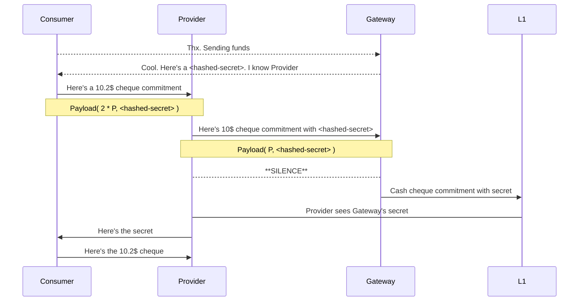
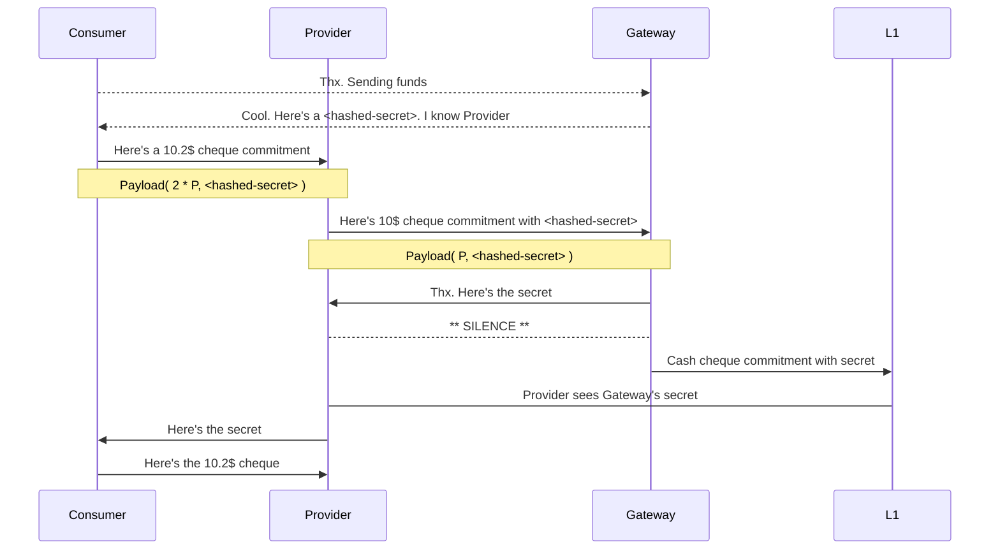

# Cardano Lightning : Design notes

This is a working document hosting our current ideas about the protocols design and features.

## Ideas to be unpacked

- multi cheque channels 
- Proof of life payments 
- minimum deposit
- dynamic fees

## Components

+ pwa for L2 payments 
+ pwa for L1/L2 account management 


## Design

### L1

#### State

+ What state do participants track? 

```ts
type State = {
    latest_cheque : BigInt,
    balance: BigInt, 
    excluded_cheques: BigInt[]
}
```


#### Constants 

The time each participant has to resolve their commitments on the L1
in the case that something goes wrong.
```ts
const L1_RESOLUTION_PERIOD = P = 24 * 60 * 60 * 1000 // Day 
```

#### Datatypes

A cheque commitment comes with a signed payload.
```ts
type Payload = {
  valid_until : Timestamp,
  hashed_secret: ByteArray,
}
```
These can be resolved on the L1 if there is failure to agree on the L2.
The secret must be provided. 

### L2 

TODO

## Examples 

### One payment, One hop

#### Well behaved


#### Evil middleman 

+ How does "Consumer" know "Provider" is paying Gateway the full fee?! 

Gateway will only reveal the secret if it matches their expectations. 
Otherwise no money will change hands. 


#### Evil Recipient

As before but Gateway doesn't play nice.
He reveals the the secret only on the L1.



#### No resolution at route source


Provider deems Consumer unreliable and my close the account. 

#### No resolution on route


Gateway deems Provider unreliable and closes the account.

### Multi-cheque 

We use Channels to handle mutliple unresolved cheques simultaneously.
This prevents channels being blocked during resolution.
Consider the case that: 

1. Consumer pays Gateway via Provider and then Dennis before resolving the first cheque.
    2. And the cheque to Gateway resolves before or after Dennis. 
    3. Or the cheque to Gateway fails to resolve.  

TODO
