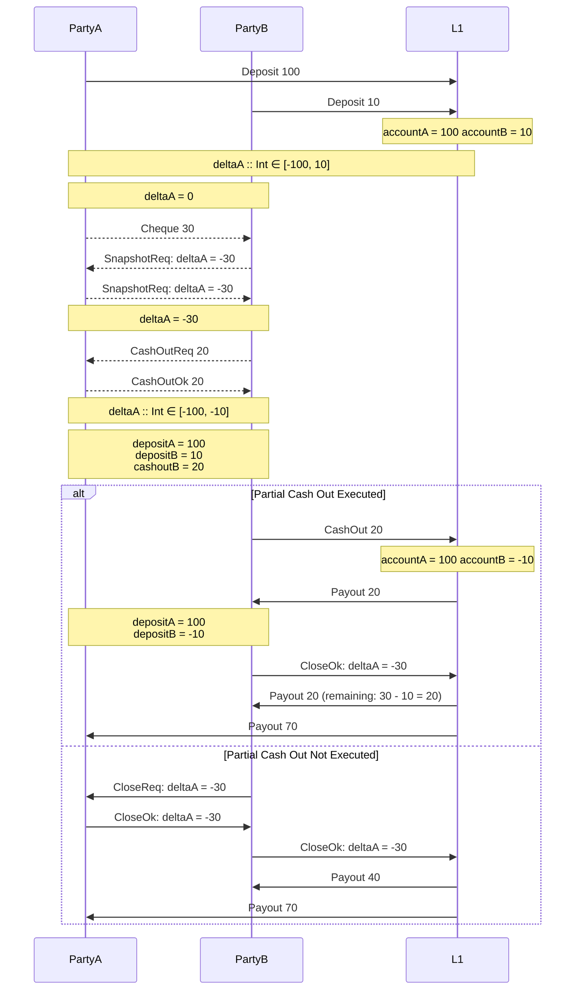
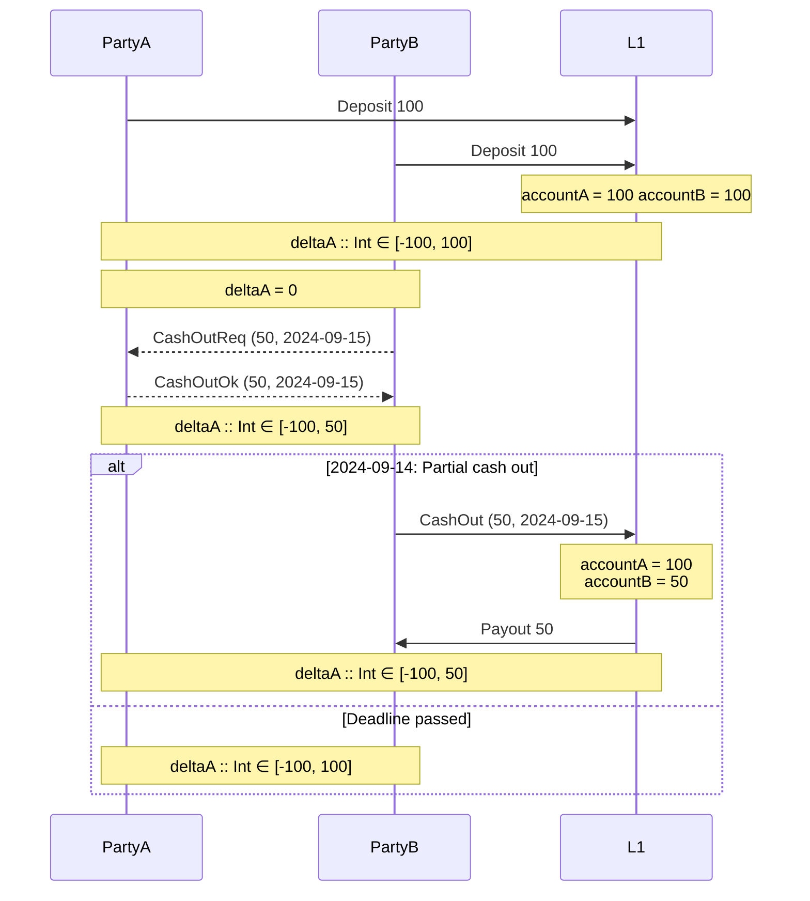

# Partial Cash Out

Let's break down a few flows of the partial cashouts to provide a context of the problem and the representation which we use to solve it.

## State

### Absolute `deltaA` Value

It seems handy to use delta of a single account as a representation of the state channel. This delta represent the change of the account balance due to all of the `L2` operations up to the "current state".

### `L1` Accounts

On the `L1` we track really the total sum of deposits and cash out per account. If a `cash out` is executed, the `L1` balance **of a particular account** is updated accordingly even if it becomes negative.

Negative balance indicates that a given party has a debt to the other party or that a given party cashed out already some funds transfered on L2 to his account.

## Cash Out as Partial Closure Payout

Belowe sequence presents a scenario with two alternative flow paths (`alt` blocks):

- In the first branch the `cash out` is executed and the remaining `closure` is performed after it.

- In the second branch the cash out is not executed and the closure is performed in one step.

Please note that the snapshot (or possibly list of cheques) which were issued during the lifetime are valid as they are because during the settlment we operate using absolute `deltaA` value.

## Cash Out as Partial Channel Freeze

`Cash out`s can be considered as partial channel freeze because they represent a possible change on the `L1` layer. Channel partners should take that into account and operate on limited funds til the channel closure or up until `cash out` deadline.

