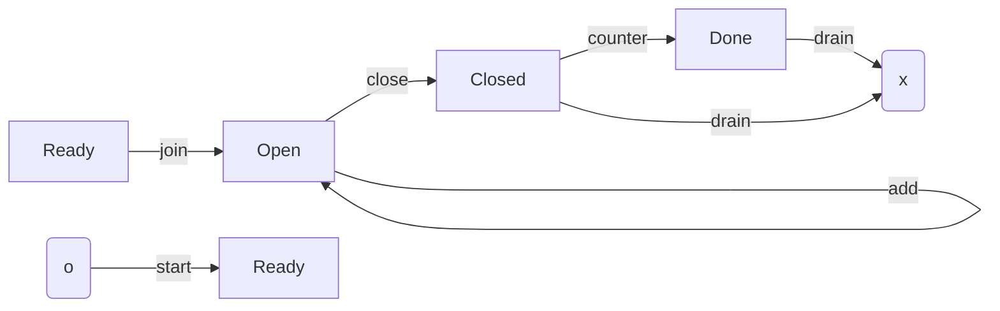

# Cardano Lightning : L1 Spec 

## Intro

Cardano lightning is p2p payment solution built over the Cardano blockchain.
It is an L2 optimized for: 

+ Near instant settlement 
+ Scalability 

It is to be interoperable with other lightning networks, and is very much inspired by bitcoin lightning. 

Users of the network maintain two party channels, through which they can send and receive funds.
We may refer to the participants of the channel as the party and counter party.

A user can perform various high level actions, including: 

1. Open, maintain, and terminate a channel
2. Send, receive, and resolve funds

The first set of actions concern the L1. 

## Channel lifecycle


## Datatypes 

```haskell
type Index = Int
type Amount = Int 

data Cheque 
  = NormalCheque Index Amount
  | LockedCheque Index Amount Lock

type Hash32 = ByteString -- 32 bytes

data Lock
  = Blake2b256 Hash32
  | SHA256 Hash32

type Exc = [Int]
type Delta = Int

data Snapshot = Snapshot {
  delta : Delta, 
  idx0: Index, 
  exc0  : Exc, 
  idx1: Index, 
  exc1  : Exc, 
}

type Sig64 = ByteString -- 64 bytes

data Signature 
  = Ed25519Signature Sig64
  | EcdsaSecp256k1Signature Sig64
  | SchnorrSecp256k1Signature Sig64

data SignedSnapshot = SignedSnapshot Snapshot Signature Signature

-- Length bound may apply for different locks.
-- Not enforced here at the type level.
data Secret = ByteString 

data SignedCheque 
  = SignedNormalCheque Cheque Signature  -- Only NormalCheque
  = SignedLockedCheque Cheque Signature Secret -- Only LockedCheque

type PubKey = ByteString -- 32 bytes 
type ChannelId = ByteString -- 32 bytes 

data Dat = Dat {
  id : ChannelId, 
  pk0 : PubKey, 
  pk1 : PubKey,
  acc0 : Amount,
  acc1 : Amount,
  snapshot : Snapshot, 
}

data Red 
  = Join
  | Add (Maybe SignedSnapshot)
  | Sub SignedSnapshot 
  | Close SignedSnapshot [SignedCheques]
  | Counter SignedSnapshot [SignedCheques]
  | Drain
```


## Validator

The dapp consists of a single validator.

### Constraints 

## Functions 

### Verify 

We support all of the currently available signature schemes available in Plutus.

Messages are prepended with the `ChannelId` as the effective nonce. 
All messages for a given channel have some cumulative element 
(eg Cheques have and `Index` and/or `Amount`) preventing reuse.

Ie concatenated with a nonce. 

```haskell
hash :: ByteString -> Hash
hash msg = 
  if (length msg == 32)
    then return msg
    else return hash' msg 

hash' :: ByteString -> Hash32
hash' = blake2b_256
  
verify :: PubKey -> ByteString -> Signature -> Bool
verify pubkey msg signature = case signature of 
  | Ed25519Signature sig -> verifyEd25519Signature pubkey msg sig
  | EcdsaSecp256k1Signature sig -> verifyEcdsaSecp256k1Signature pubkey (hash msg) sig  
  | SchnorrSecp256k1Signature sig -> verifySchnorrSecp256k1Signature pubkey (hash msg) sig


asBytes :: x serializable; x -> ByteString
asBytes x = x

verifyCheque channelId signedCheque = case signedCheque of 
  | SignedNormalCheque cheque signature -> verify (concat channelId $ asBytes cheque) signature
  | SignedLockedCheque () cheque signature 
```
