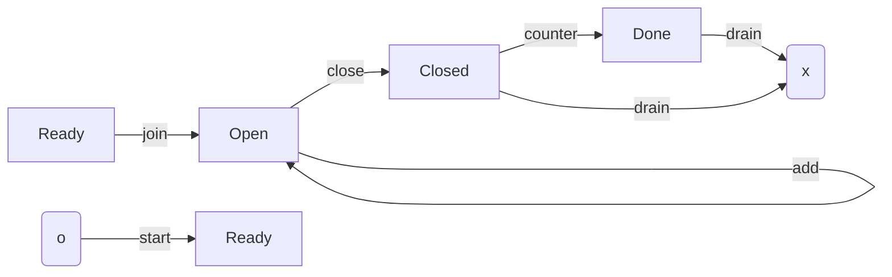

# Cardano Lightning : L1 Spec 

## Intro

Cardano lightning is p2p payment solution built over the Cardano blockchain.
It is an L2 optimized for:

+ Near instant settlement
+ Scalability

It is to be interoperable with other lightning networks, and is very much inspired by bitcoin lightning.

Users of the network maintain two party channels, through which they can send and receive funds.
We may refer to the participants of the channel as the party and counter party.

A user can perform various high level actions, including:

1. Open, maintain, and terminate a channel
2. Send, receive, and resolve funds

The first set of actions concern the L1.

## Channel lifecycle


## Datatypes

### Terminology

* `Party0` and `Party1` - refers to the party indexed as `0` and `1` respectively which are used to refer to the two parties in the channel.

* `Party` and `CounterParty`- we use both terms to refer to either party depending on the context (so `Party0` can be referred as `Party` or `CounterParty`).

* We use `Account0` or `Delta0` to refer to entities related to `Party0`. We use `*1` for `Party1`.

```haskell

-- | Ever increasing integer sequence
type Index = Int
type Amount = Int
-- | Account delta which is a difference between the current state given the off-chain set of cheques and the
-- | initial on-chain state of the channel.
type Delta = Int

-- Cheque:
-- * Signed intention to transfer money from signatory channel account to the counter party account.
-- * Cheques are indexed separately for `Party0` and `Party1`.
-- * Cheque amount for a given `Index` can be only increased.
--
-- Example: The simplest unidirectional payment flow consists of a channel which has only one cheque index with ever increasing amount.
data Cheque
  = NormalCheque Index Amount
  | LockedCheque Index Amount Lock
   -- ^ Conditional cheque which can be used only together with a secret (preimage of the lock)
   -- TODO: Introduce a timeout to the `LockedCheque` - signatory should sign intention which has expiration date.

type Hash32 = ByteString -- 32 bytes
type Hash28 = ByteString -- 28 bytes ?? 

data Lock
  = Blake2b256Lock Hash32
  | Sha2256Lock Hash32
  | Sha3256Lock Hash32

-- | Pending locked cheques which are not yet resolved. We want to exclude them
-- | from the `Squash` so they not lock the channel processing - squashing and cash outs.
type Excluded = [Index]

-- | Squash represents a total sum of the channel:
-- | * It sums up a given set of cheques (up too `idx0` and `idx1`).
-- | * It excludes a given set of cheques (up to `exc0` and `exc1`).
-- | * `Squash` can be used during channel closure and possibly empty list of:
-- |    * following cheques with `Index` greater than `idx0` or `idx1` (depending on the party)
-- |    * or cheques from the `Excluded` list together with resolution.
data Squash = Squash {
  delta0 : Delta,
  idx0 : Index,
  exc0 : Excluded,
  idx1 : Index,
  exc1 : Excluded,
}

type Sig64 = ByteString -- 64 bytes

data Signature
  = Ed25519Signature Sig64
  | EcdsaSecp256k1Signature Sig64
  | SchnorrSecp256k1Signature Sig64

data SignedSnapshot = SignedSnapshot Snapshot Signature Signature

-- Length bound may apply for different locks.
-- Not enforced here at the type level.
data Secret = ByteString 

data SignedCheque 
  = SignedNormalCheque Cheque Signature  -- Only NormalCheque
  | SignedLockedCheque Cheque Signature Secret
  -- ^ Only LockedCheque

type PubKey = ByteString -- 32 bytes 
type ChannelId = ByteString -- 32 bytes 

data FixDat = FixDat {
  id : ChannelId, 
  pk0 : PubKey, 
  pk1 : PubKey, 
}

data VarDat 
  = Ready
  | Open OpenParams
  | Closed ClosedParams
  | Done

data OpenParams = OpenParams {
  delta : Delta, 
  acc0 : Amount,
  acc1 : Amount, 
  snapshot : Snapshot,
}

data ClosedParams = ClosedParams {
  todo!
}

data Dat = Dat {
  fix : FixDat,
  var : VarDat, 
}

data Idx = Int -- output index 

data Red = Cont RedCont Idx | Drain

data RedCont 
  = Join
  | Add (Maybe SignedSnapshot)
  | Sub SignedSnapshot -- Maybe [SignedCheque]
  | Close SignedSnapshot [SignedCheque]
  | Counter SignedSnapshot [SignedCheque]
```

## Constants 

```ini
MIN_ADD = 1_000_000 # minimum add amount is 1 ada. 
```

## Validator

The dapp consists of a single validator.

### Constraints 

+ Purpose is Spend (`own_oref`).
+ Extract own datum as `Dat { fix : prev_fix, var : prev }`. 
+ Extract own value `prev_val`. Exclusively ada
+ If `Cont red_ idx = red` then 
  + Extract `next_output = outputs[idx]`
  + Address is own address
  + Value is `next_val`. Exclusively ada
  + Parse `next_output` datum as `Dat { fix : next_fix, var : next }`
  + `prev_fix == next_fix`.
+ Else is terminal `red` is `Drain`

When `(prev, red_, next)` is 

`(Ready, Join, Open(open))`: 

1. Counter party signed tx ie `extra_signatories |> includes(prev_fix.pk1)`.
2. Counter party funds account `acc1 = next_val - prev_val >= 0`
3. `next` has "default" state
ie `open = OpenParams 0 0 0 (Snapshot 0 prev_val [] acc0 [])`

`(Open(OpenParams pd pa0 pa1 ps), Add, Open(OpenParams nd na0 na1 ns))`: 

1. Snapshot and delta are unchanged: `ps == ns` and `pd == nd`
2. Ada added: `amt = next_val - prev_val >= MIN_ADD`
3. Accounts have increased: `pa0 >= na0 && pa1 >= na1 && (pa0 + pa1) + amt == (na0 + na1)`


`(Open(OpenParams pd pa0 pa1 ps), Sub cs, Open(OpenParams nd na0 na1 ns))`: 

1. TODO

`(Open(OpenParams pd pa0 pa1 ps), Close cs signedCheques, Closed(ClosedParams nd na0 na1 ns))`: 

1. TODO :  Need to track who closes

`(Closed(ClosedParams pd pa0 pa1 ps), Counter cs signedCheques, Done)`: 

1. TODO

Terminal case: 

If `prev` is `Ready`: 

1. Tx is signed by `dat.fix.pk0`.

If `prev` is `Closed`: 

1. TODO


## Functions 

### Coercion to bytes

All data has canonical serialization. 
TODO: Clarify this point.

```haskell
asBytes :: x serializable; x -> ByteString
asBytes x = x
```

### Unlocking

The protocol supports all hashing schemes available in Plutus.

A limit is placed on the size of the secret `preimg`. 
This is to prevent a scenario where a `preimg` is so large it could cause tx size issues. 
```haskell
unlocks :: Secret -> Hash32 -> Bool 
unlocks preimg lock = (img == lock) && (length preimg =< 64)
  where 
    img = case lock of
      | Blake2b256Lock h -> blake2b_256 preimg
      | Sha2256Lock h -> sha2_256 preimg
      | Sha2256Lock h -> sha3_256 preimg
```

TODO : Does this need to be set to 32 to align with 
https://gist.github.com/markblundeberg/7a932c98179de2190049f5823907c016

### Verify 

The protocol supports all signature schemes available in Plutus.
```haskell
-- Should this be sha256? sometimes?
hash :: ByteString -> Hash
hash msg = 
  if (length msg == 32)
    then return msg
    else return blake2b_256 msg 

verify :: PubKey -> ByteString -> Signature -> Bool
verify pubkey msg signature = case signature of 
  | Ed25519Signature sig -> verifyEd25519Signature pubkey msg sig
  | EcdsaSecp256k1Signature sig -> verifyEcdsaSecp256k1Signature pubkey (hash msg) sig  
  | SchnorrSecp256k1Signature sig -> verifySchnorrSecp256k1Signature pubkey msg sig
```

Messages are prepended with the `ChannelId` as the effective nonce. 
All messages for a given channel have some cumulative element 
(eg Cheques have and `Index` and/or `Amount`) preventing reuse.


Cheques 
```haskell
verifyCheque channelId pubkey signedCheque = case signedCheque of 
  | SignedNormalCheque cheque signature -> verify pubkey (concat channelId $ asBytes cheque) signature
  | SignedLockedCheque cheque signature -> 
      (verify pubkey (concat channelId $ asBytes cheque) signature) && 
      ((cheque ^. secret) `unlocks` lock) 
```

Snapshots 

```haskell
verifySnapshot channelId signedSnapshot pk0 pk1 = 
    (verify' pk0 sig0) && (verify' pk1 sig1)
  where 
    SignedSnapshot snapshot sig0 sig1 = signedSnapshot
    verify' pk sig = verify pk (concat channelId $ asBytes snapshot) sig
```
